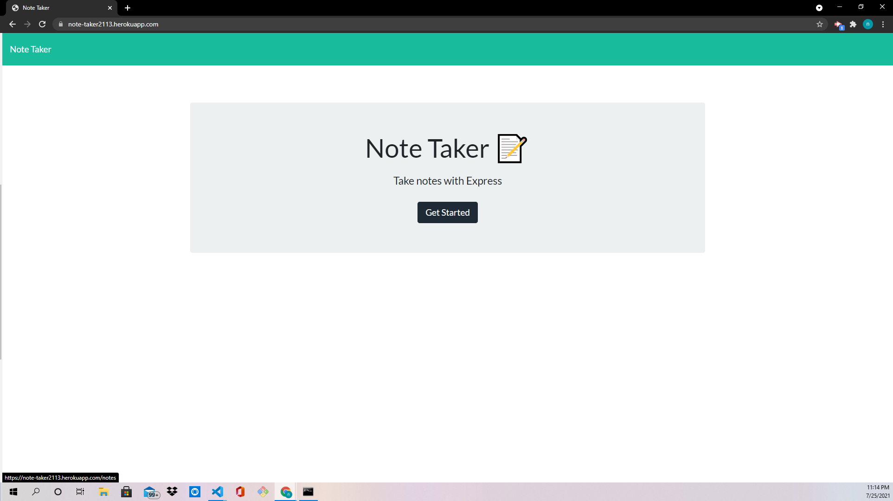
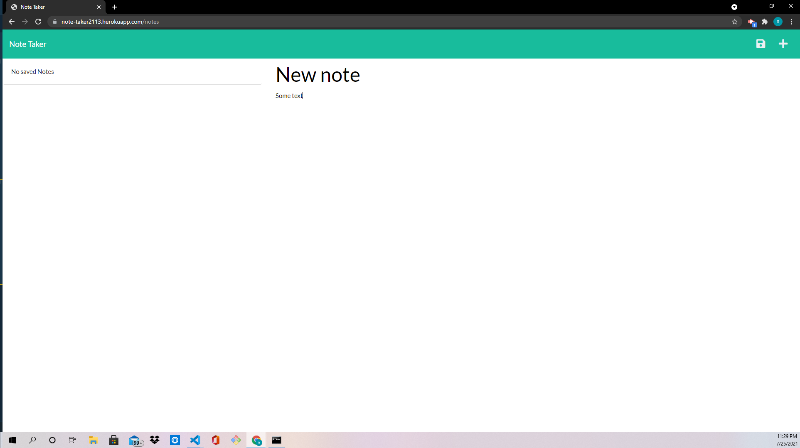

# Note Taker

## Description

A web app for taking notes.

## Usage

* Click on the "Get Started" Button.

* Enter the name of the note and then any text within the note.

* Click the save button to save note.

## Contributing

* Jonathan Faulkner
** Javasctipt
** Express.js

## Links
[GitHub]https://github.com/JonnyFaulkner/note-taker